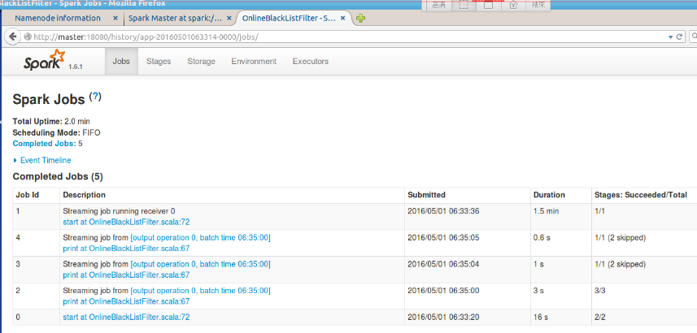

# 第1课：通过案例对Spark Streaming透彻理解三板斧之一
## Spark Streaming另类实验及本质解析

### 一. 源码定制为什么从Spark Streaming切入？

1. Spark 一开始并没我们今天看到的Spark SQL, Spark Streaming, MLlib(machine learning), GraphX(graph)， Spark R等相关内容,只有原始的Spark Core。 Spark Streaming本身是Spark Core上的一个框架，透过一个框架的彻底研究肯定可以精通Spark力量的源泉和所有Spark问题的解决之道。
2. Spark现在使用较多的除了Spark Core之外还有Spark SQL， Spark Streaming。因为Spark SQL涉及到很多SQL语法解析和优化的细节，对于我们集中精力研究Spark有所干扰。Spark R还不是很成熟，支持功能有限。GraphX最近几个版本基本没有改进，里面有很多数学算法。MLlib也涉及到很多数学知识。综合我们以Spark Streaming为切入点。

### 二. 对Spark Streaming的理解
1. Spark Streaming是流式计算，当今时代是一个流处理时代，一切数据如果不是流式处理， 或者说和流式处理不相关的话，都是无效的数据。
2. 流式处理才是我们对大数据的初步印象，而不是批处理和数据挖掘，当然Spark强悍的地方在于，他的流式处理可以在线的直接使用机器学习、图计算、SparkSQL、Spark R的成果。
3. 整个Spark的程序，基于Spark Streaming的最容易出问题，也是最受关注的地方，也是最需要人才的地方。
4. Spark Streaming和其他子框架的不同之处，Spark Streaming很像基于Spark Core之上的应用程序。
5. 寻龙点穴，Spark就是龙脉，Spark Streaming就是穴位
 
### 三. 对Spark Streaming数据的流入，流出和处理的观察

怎么做到：把Batch Interval 放的足够大，比如1分钟1次，或者5分钟1次。

### 四. 实验
```scala
package com.dt.spark.streaming

import org.apache.spark.SparkConf
import org.apache.spark.streaming.{Seconds, StreamingContext}

/**
  * 背景描述：在广告点击计费系统中，我们在线过滤掉黑名单的点击，进而保护广告商的利益，
  * 只进行有效的广告点击计费。或者在防刷评分（或者流量）系统,过滤掉无效的投票或者评分或者流量。
  * 实现技术：使用transform API直接基于RDD编程，进行join操作
  *
  * Created by Administrator on 2016/4/30.
  */
object OnlineBlackListFilter {
  def main(args: Array[String]) {
    /**
      * 第一步：创建Spark的配置对象，设置Spark程序的运行时的配置信息
      * 例如说通过setMaster来设置程序要连接的spark集群的master的url，如果设置为
      * local， 则代表Spark程序在本地运行，特别适合于机器配置条件非常差
      * （例如只有1g的内存）的初学者
      */
    val conf = new SparkConf() //创建SparkConf对象
    conf.setAppName("OnlineBlackListFilter") //设置Spark应用程序的名称，在程序运行的监控界面可以看到名称
    //    conf.setMaster("local") //此时，程序在本地运行，不需要安装Spark集群
    conf.setMaster("spark://master:7077") //此时，程序在本地运行，不需要安装Spark集群

    val ssc = new StreamingContext(conf, Seconds(300))

    /**
      * 黑名单数据准备，实际上黑名单一般都是动态的，例如在Redis中或者数据库中，黑名单的生成往往有复杂的业务逻辑，
      * 具体情况算法不同，但是在SparkStreaming进行处理的时候每次都能够访问完整的信息
      *
      */
    val blackList = Array(("hadoop", true), ("mahout", true))
    val blackListRDD = ssc.sparkContext.parallelize(blackList, 8)

    val adsClickStream = ssc.socketTextStream("master", 9999)

    /**
      * 此处模拟的广告点击的每条数据的格式为：time、name
      * 此处map操作的结果是name, (time, name)的格式
      */
    val adsClickStreamFormatted = adsClickStream.map(ads =>(ads.split(" ")(1), ads))
    adsClickStreamFormatted.transform(userClickRDD =>{
      //通过leftOuterJoin操作既保留了左侧用户广告点击内容的RDD的所有内容，又获得了相应点击内容是否在黑名单中
      val joinedBlackListRDD = userClickRDD.leftOuterJoin(blackListRDD)
      val validClicked = joinedBlackListRDD.filter(joinedItem => {
        /**
          *进行filter过滤的时候，其输入元素是一个Tuple：（name,((time, name), boolean)）
          * 其中第一个元素是黑名单的名称，第二个元素的第二个元素是进行leftOuterJoin的时候是否存在该值
          * 如果存在的话，表明当前广告点击是黑名单，需要过滤掉，否则的话则是有效点击内容；
          */
        if(joinedItem._2._2.getOrElse(false)){
          false
        } else {
          true
        }
      })
      validClicked.map(validClicked =>{ validClicked._2._1 })
    }).print()
    /**
      * 计算后的有效数据一般都会写入Kafka中，下游的计费系统会从Kafka中pull到有效数据进行计费
      */


    ssc.start()
    ssc.awaitTermination()
  }
}

```
* 启动nc -lk 9999，将应用发布到Spark集群上运行，并在nc中发送如下数据：
```sh
2016-05-01 mahout
2016-05-01 scala
2016-05-01 hadoo
2016-05-01 spark
```
* 在应用收到数据后会有如下输出
```sh
2016-05-01 scala
2016-05-01 spark
```
* 在应用收到数据得到上述输出后，按 `Ctrl+C` 中断应用。


从Spark 的history server中我们观察到运行了如下jobs

从图中我们可知， 有5个完成的job，但是我们从代码以RDD的视角来看只有一个job(print)，由此可知，Spark Streaming应用在启动过程中，会自己启动一些job。


版权声明：本笔记摘自DT大数据梦工厂Spark源码定制课程
* 原著：王家林
* 简介：DT大数据梦工厂创始人和首席专家. 
* 邮箱：18610086859@126.com 
* 电话：18610086859 
* QQ：1740415547 
* 微信：18610086859
