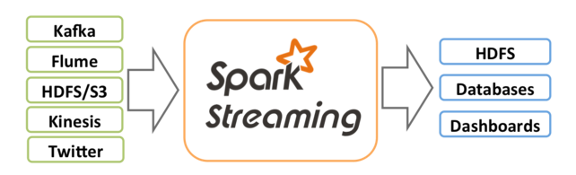
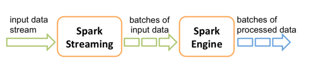
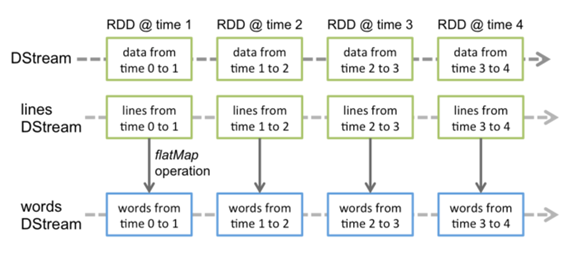
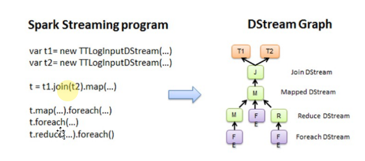
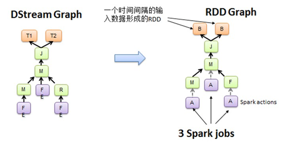
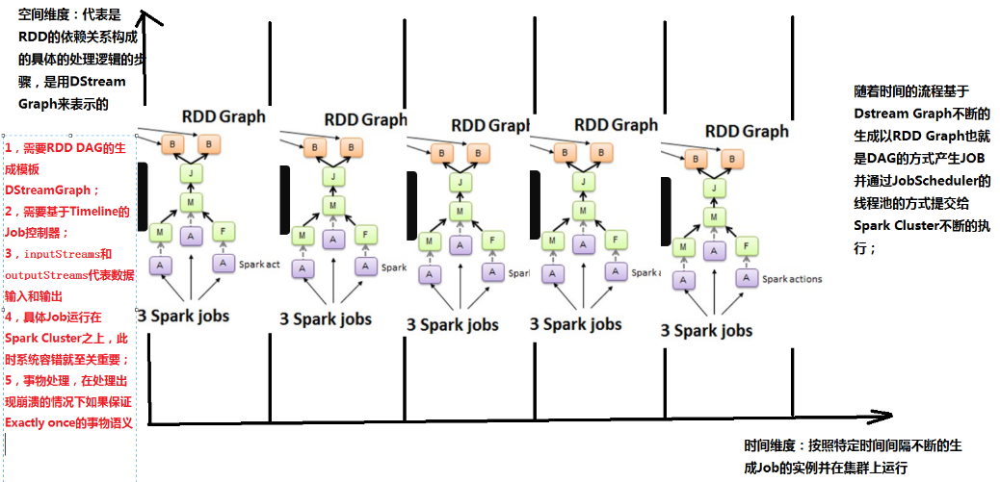

##第2课 通过案例对SparkStreaming透彻理解三板斧之二
### 二：解密SparkStreaming运行机制和架构
上节回顾：上节课谈到技术界的寻龙点穴，Spark就是大数据的龙脉，而Spark Streaming就是Spark的穴位。 Spark Streaming运行的时候，与其说是运行于Spark Core上的流式处理框架，不如说是Spark Core上的一个应用程序，Spark Streaming应用在运行时，启动了多个job，其中的receiver的job是为其他job服务的，由此得出要做复杂的Spark应用往往会有多个job，多个job之间会配合运行。

* Spark Streaming

* Spark Streaming 内部运行原理

* DStream的理解

* Spark Streaming程序到DStream Graph的转换

* Spark Streaming中Job的产生

Spark Streaming只不过是在Spark Core的基础上加上了时间的维度，RDD是基于空间维度，所以Spark Streaming就是基于时空维度。

* Spark Streaming的时空维度理解

* 就像Spark Core的编程是基于RDD的，基于Spark Streaming的编程是基于DStream的

## DStream与RDD的关系
* DStream是更高一级的抽象，RDD是底层实现，或者说DStream是逻辑级别的，RDD是物理级别的。
* 

版权声明：本笔记摘自DT大数据梦工厂Spark源码定制课程
* 原著：王家林
* 简介：DT大数据梦工厂创始人和首席专家. 
* 邮箱：18610086859@126.com 
* 电话：18610086859 
* QQ：1740415547 
* 微信：18610086859

